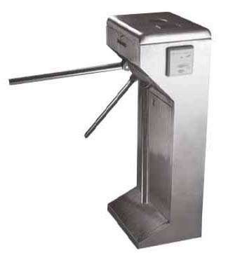

Accesos cpp
===========

## Problema

Desarrollar una aplicación que permita contabilizar la cantidad de personas que entran y salen de un lugar.

## Solución

### Punto 1 - Implementación

Desarrollamos la aplicación básica definiendo e implementando la entidad `Molinete`.

* aplicación     : [`accesos.cpp`](../punto-1/src/accesos.cpp)
* declaración    : [`Molinete.h`](../punto-1/src/Molinete.h)
* implementación : [`Molinete.cpp`](../punto-1/src/Molinete.cpp)

### Punto 2 - Implementación alternativa

Cambiamos la implementación sin afecta la interfaz expuesta por la entidad.

* aplicación     : [`accesos.cpp`](../punto-2/src/accesos.cpp)
* declaración    : [`Molinete.h`](../punto-2/src/Molinete.h)
* implementación : [`Molinete.cpp`](../punto-2/src/Molinete.cpp)

### Punto 3 - Funcionalidad ampliada

Agregamos el cómputo de máxima cantida de personas dentro.

* aplicación     : [`accesos.cpp`](../punto-3/src/accesos.cpp)
* declaración    : [`Molinete.h`](../punto-3/src/Molinete.h)
* implementación : [`Molinete.cpp`](../punto-3/src/Molinete.cpp)

